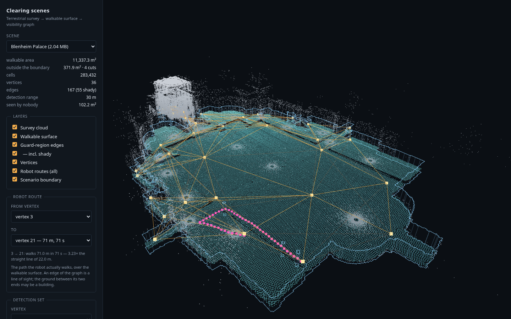
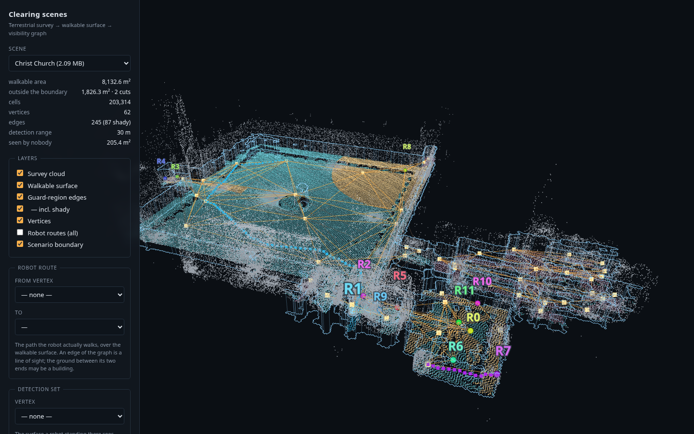

# clearing-scenes

Six real sites, each as one readable scenario file, and a working
implementation of the 2.5D team-visibility baseline of **Kolling et al. (2010)**
on top of them.

A scenario is a **visibility graph over a walkable surface**: vertices are
places a ground robot can stand, edges are the guard regions of Kolling et al.,
and `routes` gives the robot's travel time between every pair of vertices. One
YAML per scene, one npz of arrays beside it, and nothing else to install.

```bash
pip install -r requirements.txt
python scripts/run_clearing.py          # clear every scene, verified cell by cell
xdg-open web/index.html                 # look at the scenes
```

There is no drone. E1's upstream graph is bipartite over a ground and an air
family; this repository keeps the ground half, which is exactly the homogeneous
setting the 2010 paper works in. See [docs/kolling.md](docs/kolling.md) for what
adding the air family back would take.

**Every scene stops somewhere.** A survey is not a scenario: the Oxford Spires
clouds run off down service avenues and out through gateways, and a search
problem posed on all of it is posed on ground nobody was asked to clear — and,
worse, on ground an evader can walk in from. So each scene is cut to the
**scenario boundary** drawn by hand in `e1-clearing-graph` and approved there:
a few lines across the openings, and everything the lines do not separate from
the middle of the site. The walkable surface, the vertices, the guard regions
and the routes here are all what survives that cut, and the viewer draws the
line so it reads as a boundary rather than as the edge of the data.

The cut is not free, and its cost is the interesting part. It takes 12 to
1 826 m² off each site, and it takes vertices out of all proportion: Christ
Church gives up 18% of its surveyed surface, and 28 of its 90 vertices, behind
**9.5 m** of drawn line. The ground a boundary gives up is thin, and thin
ground is where the sampler put its vertices.

---

## The scenes

Oxford Spires Dataset (Tao et al., IJRR 2025) — terrestrial laser scan, six
Oxford sites. Each GIF turns once around the site: grey is the survey cloud,
teal is the walkable surface, amber is the guard-region graph, and blue is the
scenario boundary the surface was cut to.

Areas and vertex counts below are what the scenario boundary retains; the
figure in brackets is the surveyed ground it gives up.

| | | |
|:--:|:--:|:--:|
|  |  |  |
| **Christ Church** — 8 133 m² (−1 826), 62 vertices, 131 m² each. An open quad takes a handful of vertices; the rest go to the cloisters and passages, where a 30 m sensor is stopped by a wall a few metres away. Two cuts totalling 9.5 m take out the meadow approach and a quarter of the vertex set. | **Bodleian Library** — 11 469 m² (−1 490), 112 vertices. The largest instance and the one the baseline finds hardest: 22 robots against 8 for Blenheim's near-identical floor area. Enclosure, not size, is what costs robots. | **Blenheim Palace** — 11 337 m² (−372) of mostly open forecourt, 36 vertices, 315 m² each. The sparsest graph in the set. |
|  |  |  |
| **Keble College** — 6 171 m² (−194) across two quads, 24 vertices, 257 m² each. Open ground again, and the one scene where the boundary halved the team. | **Observatory Quarter** — 2 838 m² (−667) between buildings, 39 vertices, 73 m² each. What a site cut up by structure looks like in the graph, and the heaviest cut in the set at 19% of its survey. | **HB Allen Centre** — 1 280 m² (−12), 20 vertices. The smallest scene, barely bounded at all, and the one to try things on first. |

---

## What the baseline does with them

`scripts/run_clearing.py`, verified cell by cell by `clearing/verify.py`:

| scene | area m² | vertices | edges | GRAPH-CLEAR label | peak team (tree order) | peak team (sweep) | steps | makespan h | residual m² |
|---|---:|---:|---:|---:|---:|---:|---:|---:|---:|
| Blenheim Palace | 11 337 | 36 | 167 (55 shady) | 18 | **8** | 9 | 20 | 0.3 | 0.0 |
| Bodleian Library | 11 469 | 112 | 808 (238 shady) | 29 | **22** | 27 | 63 | 1.6 | 17.6 |
| Christ Church | 8 133 | 62 | 245 (87 shady) | 17 | **12** | 15 | 47 | 0.5 | 6.3 |
| Observatory Quarter | 2 838 | 39 | 203 (74 shady) | 23 | 13 | **12** | 26 | 0.3 | 4.5 |
| HB Allen Centre | 1 280 | 20 | 84 (26 shady) | 14 | **10** | 12 | 13 | 0.1 | 4.2 |
| Keble College | 6 171 | 24 | 84 (44 shady) | 12 | **5** | 5 | 20 | 0.2 | 0.0 |

Every scene is cleared. **Two of them are now cleared outright** — Blenheim and
Keble finish with no residual at all — and the other four need the qualifier
they always did: **cleared except what no vertex can see**. The sampler upstream
stopped when marginal gain fell below the smallest admissible walkable
component, so 57–409 m² per scene is covered by no detection set at all, and no
schedule over this vertex set can clear it — `verify.all_at_once`, every vertex
occupied simultaneously, is the proof. Small fragments of that set are removed
from the evader space; what is left is the residual column above.

**What the boundary did to these numbers.** Every column moved, and not all of
it in the direction the cut suggests. Christ Church loses 28 vertices and four
robots, 16 → 12, and its residual falls 22.1 → 6.3 m²: most of what no vertex
could see was in the thin ground outside the line. Keble loses one vertex in
twenty-five and halves its team, 9 → 5. Blenheim goes 9 → 8 and clears
completely.

The Bodleian went the other way: 134 vertices down to 112, and the peak team
**up** from 21 to 22. That is not noise and it is not a defect in the cut. The
boundary took out the open forecourt approaches, which are cheap ground — one
robot standing in the open holds a great deal of frontier — and left the
enclosed core, which is the expensive part. Cutting a site down does not make
it easier to clear; it makes it *denser*, and density is what costs robots.
The residual rose with it, 13.1 → 17.6 m², for the same reason.

Observatory Quarter is the one place the two baselines swapped: the sweep now
beats the tree order, 12 against 13. With 39 vertices instead of 47 the
principal-axis order happens to fit the site's long thin shape better than the
spanning tree does. It is a coincidence of this instance, not a finding about
the two orders, and it is in the table because hiding it would make the tree
order look uniformly better than it is.

The gap between the label and the peak team is not a defect in either. The label
charges a robot per blocked edge and cannot see that one robot standing at `p_j`
holds every guard region inside `D(p_j)` at once. The schedule covers the
frontier with a set cover over vertices instead. [docs/kolling.md](docs/kolling.md)
works through both.

The full schedules — which vertices are held at every step — are in
`examples/<scene>.clearing.yaml`.

The planner above is a good one and it is **not the 2010 paper's**. The paper's
own machinery is implemented separately and run separately — see the next
section.

**The peak team is the whole team.** `clearing/roster.py` puts identities on a
schedule: a fleet matched to the steps by least total travel, where a robot the
next step does not need parks where it stands and is re-tasked later. The fleet
that comes out is exactly the peak team — 8 machines at Blenheim, 22 at the
Bodleian — and `fleet` is reported beside `team_peak` in every run so that a
regression in it cannot pass unseen.

That matching is also where the makespan comes from, and moving it here changed
the column above. Most scenes got faster, because a robot parked two vertices
away beats a fresh one walking in from the entry: measured when the change was
made, on the unbounded scenes, the Bodleian dropped from 2.1 h to 1.5 h and
Christ Church went the other way, 0.9 h to 1.1 h. Those two figures are kept as
they were measured; the makespan column above is the current, bounded one and
is not comparable with them. The assignment
minimises the fleet's TOTAL travel while the makespan is a sum of per-step
maxima, so a matching that walks less in total can still walk further in the one
step that sets the clock. Minimax matching per step is a different objective and
a different claim about what the team is doing; it is not what is computed here.

---

## The published method, run as published

`clearing/kolling.py` above computes a GRAPH-CLEAR label and then covers the
**cell** frontier. Neither half is what Kolling et al. (2010) do: they cite
GRAPH-CLEAR as the alternative model they do *not* use, and their planner never
looks at a cell. `clearing/gsst.py` is their machinery instead — vertex
contamination after Hollinger et al., the Barrière et al. tree label with
**sliding forbidden**, and GSST's anytime layer over 100 random depth-first
spanning forests. `scripts/run_gsst.py` runs it.

**The paper's first finding reproduces.** Treating only *regular* edges as cycle
edges — dropping the shady ones, whose guard regions are strictly contained in
another vertex's — is reported as worth 2–3 robots in the minimum. On geometry
the authors never saw:

| scene | n | naive | regular | regular + biased tree |
|---|--:|--:|--:|--:|
| Blenheim Palace | 36 | 11 | **9** | 9 |
| Bodleian Library | 112 | 20 | **17** | 17 |
| Christ Church | 62 | 10 | **8** | 8 |
| HB Allen Centre | 20 | 9 | **8** | 8 |
| Keble College | 24 | 7 | 6 | **5** |
| Observatory Quarter | 39 | 14 | **11** | 13 |
| | | | | **mean saved +2.2** |

The paper's *third* variant does not pay here: biasing the spanning tree toward
regular edges wins once, loses once, and has a worse mean on five of six scenes.

**And the graph clears while the ground does not.** Every schedule in that table
provably clears the guard graph under vertex contamination — which is where the
paper stops. Handed to `clearing/verify.py`, which was told nothing about guard
regions, four of six scenes are left with **thousands of square metres**
contaminated: Christ Church keeps 7 692 m² of its 8 133. That is not a data
artefact, because every vertex occupied at once leaves only 4–18 m².

The reason is one measurement, `scripts/rim_coverage.py`, and it is about the
geometry rather than about any planner. An edge says a robot at `j` can watch
*some* of the rim of `D(p_i)`. The median neighbour watches **54%** of it — and
occupying **every** neighbour of a vertex at once still leaves a gap, on **all
293 vertices of all six sites**. The guard graph records who can watch a piece
of a boundary, never whether the boundary is closed, and an arbitrarily fast
evader needs one hole.

So the 8 robots GSST reports at Christ Church are not cheaper than the cell
planner's 12; they are 8 robots that do not clear the site. The reproduction of
the shady-edge result is real and it is a result about the graph.
[docs/gsst.md](docs/gsst.md) has all three tables, the no-sliding label rule and
what was left unrun.

---

## The viewer

`web/index.html` opens straight off the file system: no server, no build step.
Switch scenes, toggle the survey cloud, the walkable surface, the graph and the
scenario boundary, click a vertex to see what it covers, pick a route to see the
ground the robot covers to walk it, and step through the clearing schedule.


The states it paints — cleared, contaminated, watched right now — are the ones
`clearing/verify.py` computed, shipped alongside the schedule, so the picture
cannot disagree with the numbers beside it.

**The boundary.** Drawn as a low blue fence whose foot is exactly the line. A
line lying on the floor is not visible from the overhead view a site is read
from — the walkable cells are drawn as sprites nearly two cells across and
cover it — so it is extruded to a height measured per scene: just under the
lowest ground the rim runs along, up to the higher of five metres and a metre
above the highest, which is what it takes to clear the Christ Church terrace
without burying the site under a wall. It is blue and not the amber
`e1-clearing-graph` uses, because amber here is the guard-region edges and an
amber ring around the site read as more graph. The survey cloud is *not* cut to
it: the line runs along and through those buildings, and clipping the cloud
would hide the structure the line was drawn against.

**Robot routes.** An edge of the graph is a line of sight; the ground between
its two ends may be a building. The *Robot route* picker draws what the robot
actually walks — the true shortest path over the walkable surface, the one the
travel time in `scenes/*.yaml` is made of. Pick a vertex to see every route out
of it, or a second vertex for one route with its distance, its time and how far
it is from the straight line. Median detour across the six scenes is 1.08×, but
the tail is what matters: on Blenheim Palace, edge 3–21 is 22.0 m of sight line
and 71 m of walking, round the end of a wall.



**The robots, with their ids.** A schedule step is a *set* of vertices: it says
which places are held and nothing about which machine holds them, so on its own
it can only be drawn as dots blinking on and off. *Show the robots* draws the
fleet instead — R0…R7 at Blenheim, R0…R21 at the Bodleian, each with its own
colour and its id over its head. Every step lists what each one is doing: the
metres and minutes it just walked, `holds` where it stayed, `parked` where the
step had no work for it, `off site` before it arrives. Click a robot, in the
view or in the list, and the surface it watches from where it stands is painted
in its colour along with everything it has walked so far. *Play* walks the team
between two steps along the paths it really takes, not along the sight lines.



A step is instantaneous in the model. A robot in transit watches nothing, and a
parked robot standing at a vertex does see `D(v)` but is not credited with it —
the guarantee quantifies over the vertices a step names, and the walking is the
schedule's secondary cost. The viewer says so where it could otherwise mislead.

The URL is a linkable view: `#scene=christ-church&step=28`,
`#scene=christ-church&vertex=12`, `#scene=blenheim-palace&from=3&to=21`,
`#scene=christ-church&step=29&robot=1`.

---

## Layout

```
scenes/
  <scene>.yaml            the scenario: graph, guard regions, routes and times
  geometry/<scene>.npz    the arrays it points at -- cells, detection sets, cloud
  index.json              what was exported, and with which parameters

clearing/
  scene.py                loading, and the one lattice rule everything shares
  kolling.py              spanning tree, GRAPH-CLEAR label, the schedule
  gsst.py                 Kolling et al. 2010 as published: no-slide label, GSST
  verify.py               contamination propagation; does a schedule clear?
  roster.py               identities on a schedule: which robot, walking where
  render.py               a numpy software renderer, for the GIFs

scripts/
  export_from_e1.py       e1-clearing-graph -> scenes/      (needs the survey data)
  run_clearing.py         scenes/ -> examples/
  run_gsst.py             the published method, three cycle-edge variants
  rim_coverage.py         how much of a rim a neighbour can actually watch
  build_web.py            scenes/ + examples/ -> web/data/
  make_gifs.py            scenes/ -> docs/gifs/

examples/<scene>.clearing.yaml   the schedules, step by step, with their metrics
examples/<scene>.gsst.yaml       the same, for the published method
web/                             the viewer
docs/                            the format, the baseline, the GIFs
tests/                           run with `pytest tests`
```

Everything except `export_from_e1.py` reads only what is in this repository.
That one script needs `e1-clearing-graph` and its survey data, and it is where
the scenes came from.

## Writing your own planner

```python
from clearing import kolling, load, propagate, Schedule

scene = load("christ-church")

# scene.detection[v]  -> cells a robot at v certifies empty
# scene.edge_ij       -> the guard-region graph
# scene.travel_seconds[i, j] -> how long the robot takes to walk from i to j

schedule = Schedule([(0,), (0, 5), (5, 12), ...])   # vertices held per step
result = propagate(scene, schedule)
print(result.metrics(scene))
```

`propagate` knows cells, adjacency and detection sets — not guard regions, not
the regular/shady classification. That is deliberate: if a graph-level strategy
claims to clear and the verifier reports a residual, the graph abstraction is
wrong for that geometry, and the verifier has to be able to say so without
assuming the thing under test.

## Provenance

The geometry comes from `e1-clearing-graph`, the pipeline of *Heterogeneous
Guaranteed Clearing under Overhead Occlusion*: occupancy carved from the
individual E57 setups, per-voxel walkability so that structure above walkable
ground is kept as an occluder rather than absorbed into the surface, detection
sets by raycasting, and two-family sampling. The configuration exported here is
O-carved, `R = 30 m`, seed 1, inside the approved scenario boundary.
`scenes/index.json` records it, and each `scenes/<scene>.yaml` carries the
boundary's stamp — a hash over the lines that were drawn — so a scenario here
can be matched to the decision upstream that produced it.

The cut is E1's, exactly, including where E1's own index arithmetic puts a cell
one row off at an exact face of its 0.4 m boundary raster. That moves 383 cells
across the six scenes, 0.16 to 6.72 m² per scene against 1 280 to 11 469 m²
retained. They are kept as E1 keeps them rather than corrected here, because
the claim this repository makes is that its scenario *is* the approved one, and
a scenario that is nearly the approved one is worth less than one that is
exactly it. `tests/test_boundary.py` measures the seam and bounds it to the
line; the fix belongs upstream, in `boundary_apply.inside`, where it would move
all six stamps.

The Oxford Spires data is not redistributed here; the survey clouds are tens of
gigabytes and separately licensed. What is in `scenes/geometry/` is derived
geometry: the walkable surface, the detection sets, and a decimated cloud for
context.
