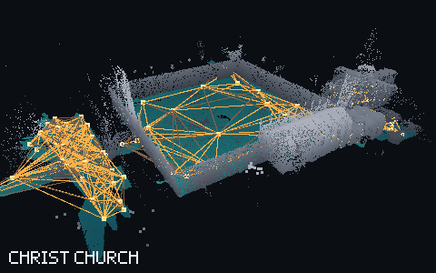
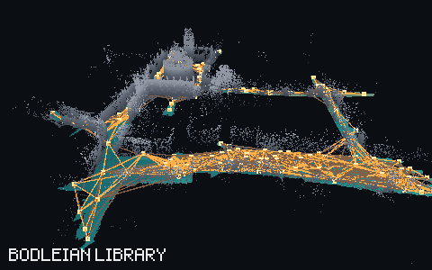
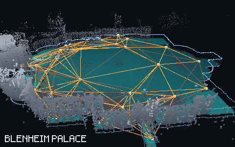
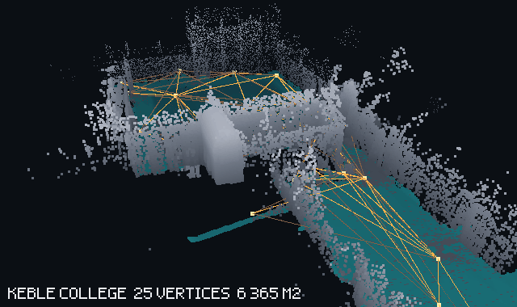
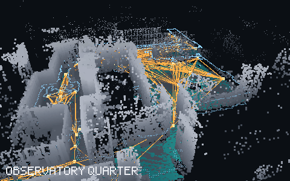
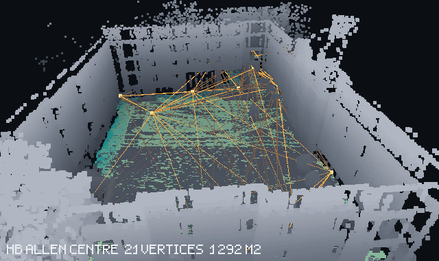
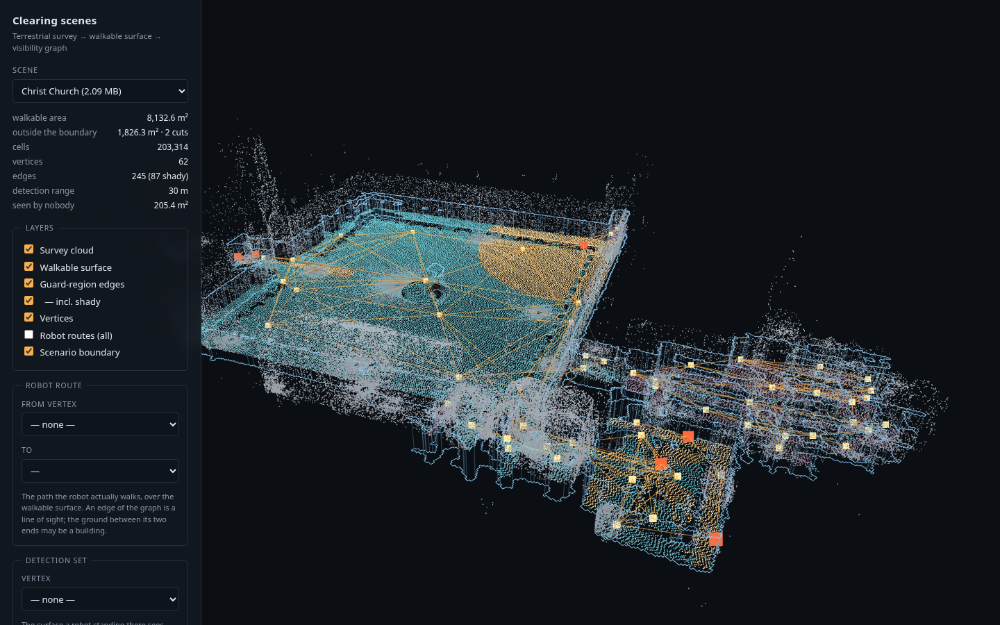

# clearing-scenes

Six real sites, each as one readable scenario file, and a working
implementation of the 2.5D team-visibility baseline of **Kolling et al. (2010)**
on top of them.

A scenario is a **visibility graph over a walkable surface**: vertices are
places a searcher can stand, edges are the guard regions of Kolling et al., and
`routes` gives the platform's travel time between every pair of vertices. One
YAML per scene, one npz of arrays beside it, and nothing else to install.

```bash
pip install -r requirements.txt
python scripts/run_gsst.py --drive      # the published method, driven and judged
xdg-open web/index.html                 # look at the scenes
```

---

## The scenes

Oxford Spires Dataset (Tao et al., IJRR 2025) — terrestrial laser scan, six
Oxford sites. Each GIF turns once around the site: grey is the survey cloud,
teal is the walkable surface, amber is the guard-region graph, and blue is the
scenario boundary the surface was cut to.

Areas and vertex counts below are what the scenario boundary retains, on the
`repaired-ground` vertex set; the figure in brackets is the surveyed ground the
boundary gives up.

| | | |
|:--:|:--:|:--:|
|  |  |  |
| **Christ Church** — 8 133 m² (−1 826), 81 vertices, 100 m² each. An open quad takes a handful of vertices; the rest go to the cloisters and passages, where a 30 m sensor is stopped by a wall a few metres away. Two cuts totalling 9.5 m take out the meadow approach and a quarter of the vertex set. | **Bodleian Library** — 11 469 m² (−1 490), 151 vertices. The largest instance and the one the published method finds hardest: 29 machines against 10 for Blenheim's near-identical floor area. Enclosure, not size, is what costs searchers. | **Blenheim Palace** — 11 337 m² (−372) of mostly open forecourt, 47 vertices, 241 m² each. The sparsest graph in the set. |
|  |  |  |
| **Keble College** — 6 171 m² (−194) across two quads, 34 vertices, 182 m² each. Open ground again, and the one scene where the boundary halved the team. | **Observatory Quarter** — 2 838 m² (−667) between buildings, 60 vertices, 47 m² each. What a site cut up by structure looks like in the graph, and the heaviest cut in the set at 19% of its survey. | **HB Allen Centre** — 1 280 m² (−12), 32 vertices. The smallest scene, barely bounded at all, and the one to try things on first. |

---

## What the published method does with them

`scripts/run_gsst.py --drive`, on the `repaired-ground` vertex set, 100 random
spanning forests per variant, seed 1. Two verdicts per strategy, and the gap
between them is the result:

| scene | area m² | vertices | edges | best variant | team | atomic residual m² | driven residual m² |
|---|---:|---:|---:|---|---:|---:|---:|
| Blenheim Palace | 11 337 | 47 | 258 (88 shady) | regular | **10** | 0.0 | **0.0** |
| Bodleian Library | 11 469 | 151 | 1 408 (365 shady) | regular_biased | **29** | 10 920 | **0.0** |
| Christ Church | 8 133 | 81 | 367 (134 shady) | regular | **13** | 7 749 | **0.0** |
| Observatory Quarter | 2 838 | 60 | 481 (142 shady) | regular_biased | **18** | 2 762 | **0.0** |
| HB Allen Centre | 1 280 | 32 | 229 (64 shady) | regular_biased | **13** | 1 185 | **0.0** |
| Keble College | 6 171 | 34 | 183 (94 shady) | regular | **8** | 0.0 | **0.0** |

---

## The viewer

`web/index.html` opens the webviewer.



---

## Layout

```
scenes/
  <scene>.yaml            the scenario: graph, guard regions, routes and times
  geometry/<scene>.npz    the arrays it points at -- cells, detection sets, cloud
  index.json              what was exported, and with which parameters

clearing/
  scene.py                loading, and the one lattice rule everything shares
  gsst.py                 Kolling et al. 2010 as published: no-slide label, GSST
  verify.py               contamination propagation, atomically: does it clear?
  execute.py              the same strategy driven one machine at a time
  clock.py                and judged on a wall clock, charging for the interval
  roster.py               identities on a strategy: which machine, walking where
  render.py               a numpy software renderer, for the GIFs

scripts/
  export_from_e1.py       e1-clearing-graph -> scenes/      (needs the survey data)
  run_gsst.py             the published method, three cycle-edge variants
  boundary_coverage.py    how much of dD(p) a neighbour can actually watch
  build_web.py            scenes/ + examples/ -> web/data/
  make_gifs.py            scenes/ -> docs/gifs/

examples/<scene>.gsst.yaml       the strategies, step by step, with their
                                 metrics -- atomic and driven
web/                             the viewer
docs/glossary.md                 defines the used variables
docs/                            the format, the method, the GIFs
tests/                           run with `pytest tests`
```

Everything except `export_from_e1.py` reads only what is in this repository.
That one script needs `e1-clearing-graph` and its survey data, and it is where
the scenes came from.

## Writing your own planner

```python
from clearing import clock, execute, load, propagate, Strategy

scene = load("christ-church")

# scene.detection[v]  -> D(p): cells a searcher at v certifies empty
# scene.edge_ij       -> the guard-region graph
# scene.travel_seconds[i, j] -> how long the platform takes to walk from i to j

strategy = Strategy([(0,), (0, 5), (5, 12), ...])   # vertices held per step
print(propagate(scene, strategy).metrics(scene))    # atomic: steps are instants

driven = execute.sequentialise(scene, strategy)     # one machine at a time
print(clock.timeline_propagate(scene, driven.strategy, driven.roster,
                               exact=True))         # and charged per interval
```

`propagate` knows cells, adjacency and detection sets — not guard regions, not
the regular/shady classification. That is deliberate: if a graph-level strategy
claims to clear and the verifier reports a residual, the graph abstraction is
wrong for that geometry, and the verifier has to be able to say so without
assuming the thing under test.

**Run both.** On this geometry they do not agree, and the disagreement is the
interesting part: the atomic verdict is the model Kolling et al. work in, and
the driven one is what happens when the machines have to get there. A planner
that clears atomically may leave the site open for the length of a drive, and
one that looks hopeless atomically may hold it — the published method does the
second on four of the six scenes.
